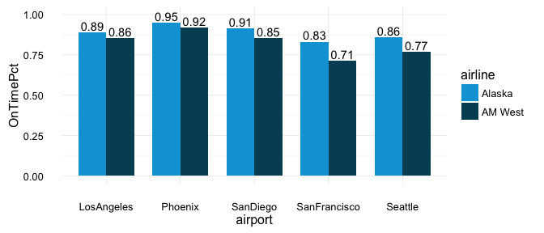
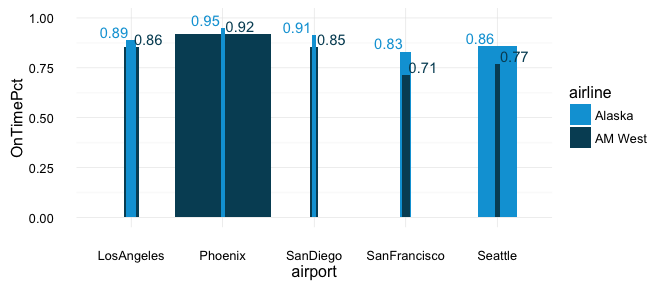

Hao-Week5
================
Bruce Hao
September 23, 2016

``` r
library(tidyr)
library(dplyr)
library(ggplot2)
library(ggthemes)
```

**1. Create a .CSV file (or optionally, a MySQL database!) that includes all of the information above. You’re encouraged to use a “wide” structure similar to how the information appears above, so that you can practice tidying and transformations as described below.**

Create data frame housing airline status information. Write data frame to csv file. Read csv file back to data frame. I commented it out to prevent the path name from causing an error.

``` r
airlines = data.frame(
  airline = c('Alaska', 'Alaska', 'AM West', 'AM West'),
  status = c('on time', 'delayed', 'on time', 'delayed'),
  LosAngeles = c(497, 62, 694, 117),
  Phoenix = c(221, 12, 4840, 415),
  SanDiego = c(212, 20, 383, 65),
  SanFrancisco = c(503, 102, 320, 129),
  Seattle = c(1841, 305, 201, 61)
)

#write.csv(airlines, file = '/Users/brucehao/Desktop/airlines.csv', row.names = F)
#airlines = read.csv('/Users/brucehao/Desktop/airlines.csv')

airlines
```

    ##   airline  status LosAngeles Phoenix SanDiego SanFrancisco Seattle
    ## 1  Alaska on time        497     221      212          503    1841
    ## 2  Alaska delayed         62      12       20          102     305
    ## 3 AM West on time        694    4840      383          320     201
    ## 4 AM West delayed        117     415       65          129      61

**2. Read the information from your .CSV file into R, and use tidyr and dplyr as needed to tidy and transform your data.**

I've broken the tidying exercise up step by step to help visualize the process. In part 3 below, the intermediate steps are hidden.

1.  gather all flights by adding an 'airport' key and 'flights' value;

``` r
airlines2 = airlines %>% 
  gather(airport, flights, -(1:2)) 
airlines2
```

    ##    airline  status      airport flights
    ## 1   Alaska on time   LosAngeles     497
    ## 2   Alaska delayed   LosAngeles      62
    ## 3  AM West on time   LosAngeles     694
    ## 4  AM West delayed   LosAngeles     117
    ## 5   Alaska on time      Phoenix     221
    ## 6   Alaska delayed      Phoenix      12
    ## 7  AM West on time      Phoenix    4840
    ## 8  AM West delayed      Phoenix     415
    ## 9   Alaska on time     SanDiego     212
    ## 10  Alaska delayed     SanDiego      20
    ## 11 AM West on time     SanDiego     383
    ## 12 AM West delayed     SanDiego      65
    ## 13  Alaska on time SanFrancisco     503
    ## 14  Alaska delayed SanFrancisco     102
    ## 15 AM West on time SanFrancisco     320
    ## 16 AM West delayed SanFrancisco     129
    ## 17  Alaska on time      Seattle    1841
    ## 18  Alaska delayed      Seattle     305
    ## 19 AM West on time      Seattle     201
    ## 20 AM West delayed      Seattle      61

1.  we then spread the status column into two new columns 'delayed' and 'on time';

``` r
airlines3 = airlines2 %>% 
  spread(status, flights) 
airlines3
```

    ##    airline      airport delayed on time
    ## 1   Alaska   LosAngeles      62     497
    ## 2   Alaska      Phoenix      12     221
    ## 3   Alaska     SanDiego      20     212
    ## 4   Alaska SanFrancisco     102     503
    ## 5   Alaska      Seattle     305    1841
    ## 6  AM West   LosAngeles     117     694
    ## 7  AM West      Phoenix     415    4840
    ## 8  AM West     SanDiego      65     383
    ## 9  AM West SanFrancisco     129     320
    ## 10 AM West      Seattle      61     201

1.  then, using the mutate function we create a 'total' flights column;

``` r
airlines4 = airlines3 %>%
  mutate('total' = delayed + `on time`) 
airlines4
```

    ##    airline      airport delayed on time total
    ## 1   Alaska   LosAngeles      62     497   559
    ## 2   Alaska      Phoenix      12     221   233
    ## 3   Alaska     SanDiego      20     212   232
    ## 4   Alaska SanFrancisco     102     503   605
    ## 5   Alaska      Seattle     305    1841  2146
    ## 6  AM West   LosAngeles     117     694   811
    ## 7  AM West      Phoenix     415    4840  5255
    ## 8  AM West     SanDiego      65     383   448
    ## 9  AM West SanFrancisco     129     320   449
    ## 10 AM West      Seattle      61     201   262

and 4) finally we group by airline and summarize the total on time flights divided by the total flights.

``` r
airlines5 = airlines4 %>%
  group_by(airline) %>% 
  summarise(OnTimePct = sum(`on time`) / sum(total))
airlines5
```

    ## # A tibble: 2 x 2
    ##   airline OnTimePct
    ##    <fctr>     <dbl>
    ## 1  Alaska 0.8672848
    ## 2 AM West 0.8910727

**3. Perform analysis to compare the arrival delays for the two airlines.**

First, let's evaluate each airline's overall performance in terms of ratio of total on time arrivals to total flights.

Based on this particular analysis, it appears that AM West has a slightly better on time ratio than does Alaska.

``` r
airlines %>% 
  gather(airport, flights, -(1:2)) %>% 
  spread(status, flights) %>%
  mutate('total' = delayed + `on time`) %>%
  group_by(airline) %>% 
  summarise(OnTimePct = sum(`on time`) / sum(total)) %>%
  ggplot(aes(x = airline, y = OnTimePct, fill = airline)) + 
    geom_bar(stat = 'identity', width = 0.5) + 
    geom_text(aes(label = format(OnTimePct, digits = 2)), vjust = -0.25) + 
    scale_y_continuous(limits = c(0, 1)) +
    scale_fill_economist() +
    theme_minimal()
```


Next, let's evaluate each airlines performance on an airport by airport basis. In this case, we follow the same steps except that we group by both airline and airport. Additionally, we plot airport on the x-axis instead of airline and use color coding to indicate the airline.

Based on this analysis, it's now clear that Alaska actually has a better on time ratio than AM West at each of the five airports.

``` r
airlines %>% 
  gather(airport, flights, -(1:2)) %>% 
  spread(status, flights) %>%
  mutate('total' = delayed + `on time`) %>%
  group_by(airline, airport) %>% 
  summarise(OnTimePct = sum(`on time`) / sum(total)) %>%
  ggplot(aes(x = airport, y = OnTimePct, fill = airline)) + 
    geom_bar(stat = 'identity', width = 0.75, position = 'dodge') + 
    geom_text(aes(label = format(OnTimePct, digits = 2)), position = position_dodge(width=0.75), vjust = -0.25) +
    scale_y_continuous(limits = c(0, 1)) +
    scale_fill_economist() +
    theme_minimal()
```



The chart below tries to explain this apparent contradiction. The width of the bars below represents the total number of flights for each airline at each airport. AM West obviously makes a lot of flights to/from Phoenix, where on time performance is generally better than at the other airports for both airlines. Taken together, these factors combine to 'pull up' AM West's overall on time performance and hides the fact that it actually performs worse than does Alaska at each and every airport, including Phoenix.

``` r
airlines %>% 
  gather(airport, flights, -(1:2)) %>% 
  spread(status, flights) %>%
  mutate('total' = delayed + `on time`) %>%
  group_by(airline, airport) %>% 
  summarise(OnTimePct = sum(`on time`) / sum(total), Total = sum(total)) %>%
  ggplot(aes(x = airport, y = OnTimePct, fill = airline, width = Total/5000)) + 
    geom_bar(stat = 'identity') + 
    geom_text(aes(label = format(OnTimePct, digits = 2), color = airline), position = position_dodge(width=0.75), vjust = -0.25) +
    scale_y_continuous(limits = c(0, 1)) +
    scale_fill_economist() +
    scale_color_economist() +
    theme_minimal()
```



**4. Your code should be in an R Markdown file, posted to rpubs.com, and should include narrative descriptions of your data cleanup work, analysis, and conclusions.**
